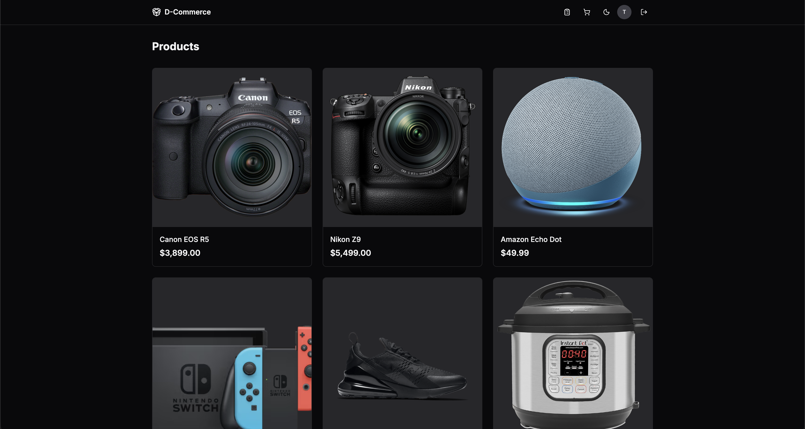
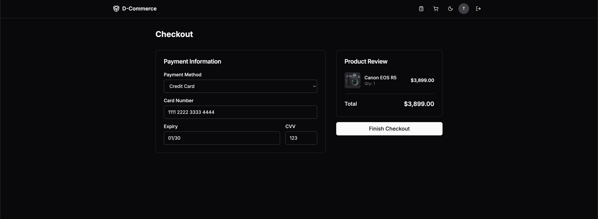
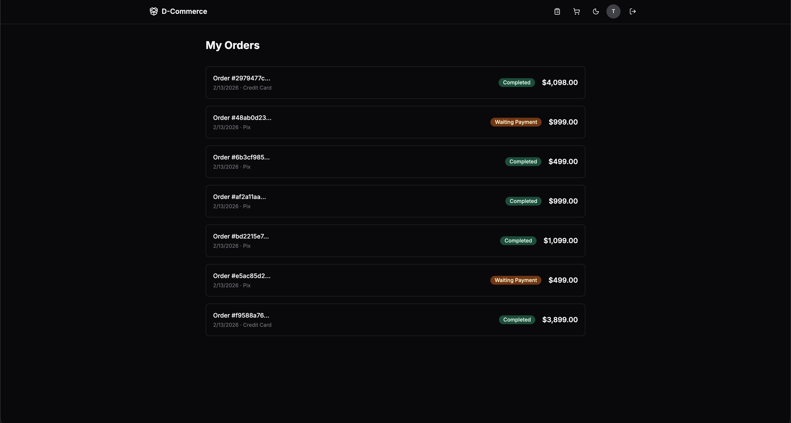

# Event Driven Commerce

## Overview

An ecommerce application built applying concepts of distributed systems, microservices, and event-driven architecture.

The **API Gateway** serves REST endpoints to the frontend and internally performs gRPC calls to backend microservices. Additionally, there is an asynchronous communication flow for order payment where `mc-order-service` publishes events to RabbitMQ and `mc-payment-service` processes them asynchronously, updating order status upon completion.

## Architecture Diagram


## Technologies

### Backend

- **Go** — all backend services
- **Echo** — HTTP framework (API Gateway)
- **gRPC / Protocol Buffers** — inter-service communication
- **RabbitMQ** — async messaging with dead-letter queues
- **PostgreSQL** — database per service
- **OpenTelemetry + Jaeger** — distributed tracing
- **Goose** — database migrations

### Frontend

- **TypeScript**
- **React 19** with **Vite**
- **Tailwind CSS**
- **Zustand** — state management
- **TanStack React Query** — server state / data fetching
- **React Router** — client-side routing

### Infrastructure

- **Docker** — multi-stage builds per service
- **Docker Compose** — local orchestration

## Services

| Service | Type | Port | Description |
|---|---|---|---|
| `mc-api-gateway` | HTTP (REST) | 8080 | API Gateway — routes requests to backend services via gRPC |
| `mc-customer-service` | gRPC | 50051 | Customer registration, authentication (JWT + bcrypt) |
| `mc-product-service` | gRPC | 50050 | Product catalog and inventory management |
| `mc-order-service` | gRPC + Queue | 50052 | Order creation and lifecycle management |
| `mc-payment-service` | Queue Consumer | — | Processes payments asynchronously, publishes completion events |
| `mc-frontend` | Vite Dev Server | 5173 | React frontend |

## Event-Driven Flow

The order payment flow uses RabbitMQ for asynchronous processing:

```
1. Frontend → POST /api/orders → API Gateway
2. API Gateway → gRPC → Order Service (creates order with WAITING_PAYMENT status)
3. Order Service → publishes event → RabbitMQ
4. Payment Service ← consumes event ← RabbitMQ
5. Payment Service processes payment and publishes to order.completed queue
6. Order Service ← consumes completion event ← updates order status
```

## API Endpoints

| Method | Endpoint | Description |
|---|---|---|
| `POST` | `/api/auth/signup` | Register a new customer |
| `POST` | `/api/auth/signin` | Sign in and receive JWT |
| `GET` | `/api/products` | List products (paginated) |
| `POST` | `/api/orders` | Create a new order (protected) |
| `GET` | `/api/orders` | Get user orders (protected) |

## How to Run

### Prerequisites

- Docker and Docker Compose
- Go 1.22+
- Node.js 18+

### Start Infrastructure

```bash
# Starts PostgreSQL, RabbitMQ, and Jaeger
sh scripts/env_up.sh
```

### Run Services

Each service can be run individually from its directory:

```bash
# Example: run the API Gateway
cd apps/mc-api-gateway && make run

# Example: run the Order Service
cd apps/mc-order-service && make run
```

### Run Frontend

```bash
cd apps/mc-frontend
npm install
npm run dev
```

### Useful URLs

| Service | URL |
|---|---|
| API Gateway | http://localhost:8080 |
| Jaeger UI | http://localhost:16686 |
| RabbitMQ Management | http://localhost:15672 |

## Screenshots

### Products Page



### Checkout



### Order List



### Order — Waiting Payment


### Order — Completed


## Project Structure

```
├── apps/
│   ├── mc-api-gateway/       # REST API Gateway (Echo)
│   ├── mc-customer-service/  # Customer Service (gRPC)
│   ├── mc-order-service/     # Order Service (gRPC + Queue Consumer)
│   ├── mc-payment-service/   # Payment Service (Queue Consumer)
│   ├── mc-product-service/   # Product Service (gRPC)
│   └── mc-frontend/          # React Frontend (Vite)
├── packages/
│   ├── grpc/                 # Shared protobuf definitions
│   └── tracing/              # OpenTelemetry tracing utilities
├── configs/                  # Configuration files
├── scripts/                  # Deployment and setup scripts
└── docs/                     # Architecture diagrams and screenshots
```
